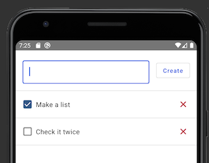
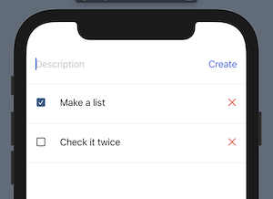

# To-Do

A Kotlin Multiplatform to-do list app with SwiftUI and Compose UI frontends

🎶  
_Making a list_  
_Checking it twice_  
_Gonna try out declarative UIs_  
🎵

 

## Shared code

The core logic in the `shared` module is implemented via SqlDelight
in [ToDo.sq](shared/src/commonMain/sqldelight/com/russhwolf/todo/shared/db/ToDo.sq). This is exposed in a Kotlin API
by [ToDoRepository](shared/src/commonMain/kotlin/com/russhwolf/todo/shared/repository/ToDoRepository.kt).

The [SKIE plugin](https://skie.touchlab.co/intro) is used to convert the Kotlin to a Swift-friendly API for the iOS app.
Some extra manual conversion is done to move from a Kotlin data class to a Swift struct.

Unit tests verify the happy path for both repository classes, making use of
the [Turbine](https://github.com/cashapp/turbine) library for testing `Flow`s. Not a whole lot new there if you're used
to testing KMP code, but they're there to look at nonetheless.

## Android code

The Android app in the `androidApp` modules is a single
activity [ToDoActivity](androidApp/src/main/java/com/russhwolf/todo/androidApp/ToDoActivity.kt) which injects
a `ToDoRepository` into composable views defined
in [ToDoComposables.kt](androidApp/src/main/java/com/russhwolf/todo/androidApp/ToDoComposables.kt). There is a fully
interactable preview function `ToDoListPreview()` which exercises the UI without any dependence on the shared code by
manually wiring in-memory state

## iOS code

The iOS app in the `iosApp` directory consumes the repository in [ToDoApp.swift](iosApp/ToDo/SceneDelegate.swift), and
renders it via SwiftUI views defined in [ToDoViews.swift](iosApp/ToDo/ToDoViews.swift). There is a fully interactable
preview view defined in `ToDoList_Previews` which exercises the UI without any dependence on the shared code by manually
wiring in-memory state.

The Swift code converts the Kotlin`ToDo` class to a Swift `ToDo` struct via utilities
in [ToDo.swift](iosApp/ToDo/ToDo.swift). This better matches typical Swift development practices, and it means that the
SwiftUI views have no direct dependence on the Kotlin code, which apparently helps the preview work better.

## Other Notes

The project is using Gradle 8.x.x and requires Java 17, you will need to make sure your gradle jvm is set to 17.
